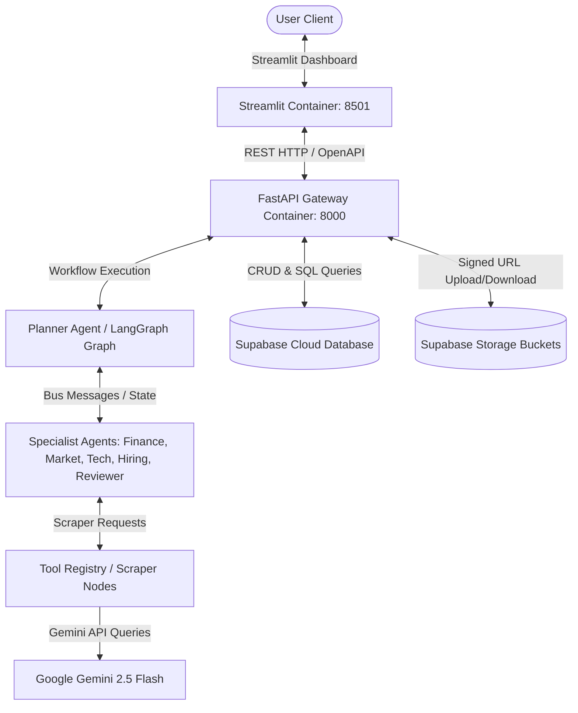
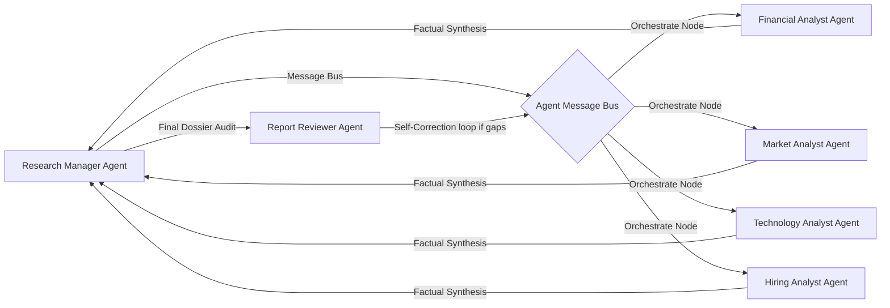
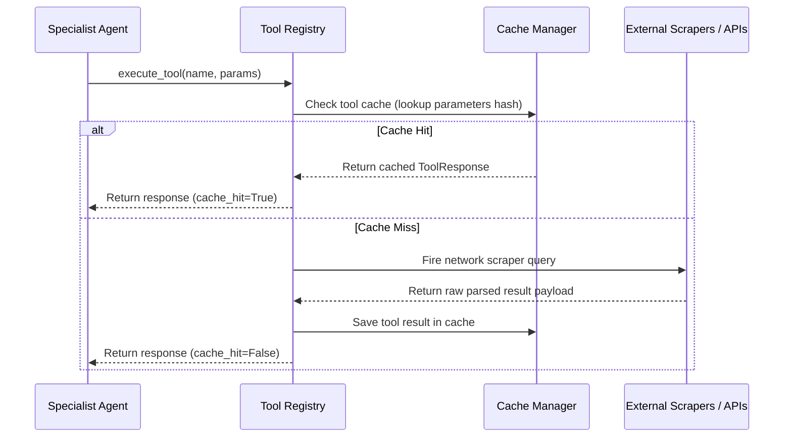
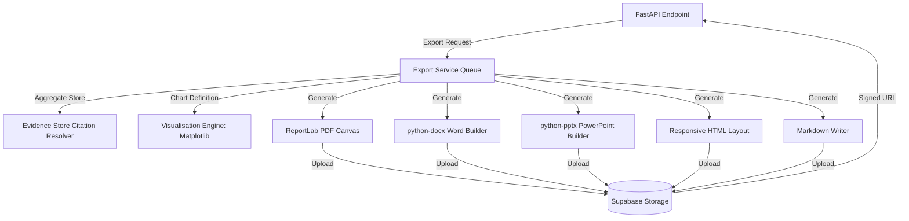
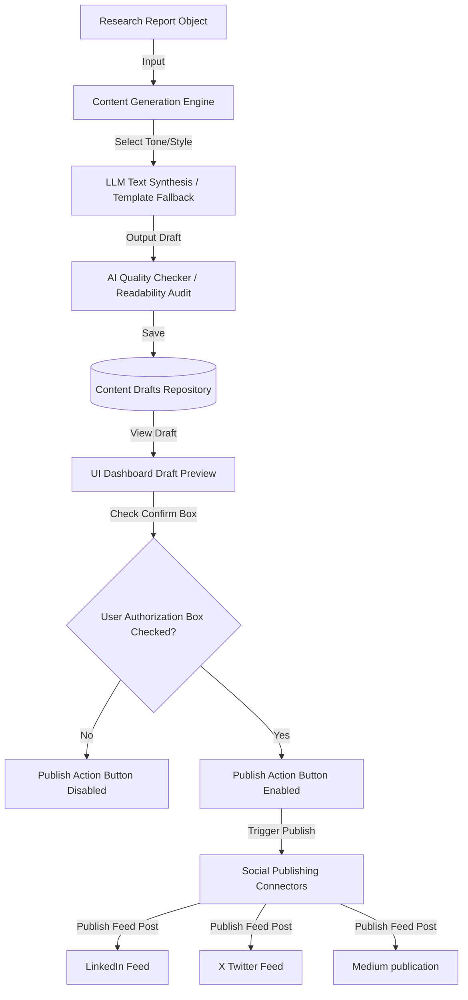

# GravityAI Architecture Diagrams

This handbook compiles architectural specifications and structural diagrams detailing the GravityAI AI Research Operating System.

---

## 1. System Architecture Diagram

---

## 2. Agent Collaboration & Bus Architecture

---

## 3. Tool Calling Flow

---

## 4. Export & Compilation Flow

---

## 5. Content Generation & Publishing Safety Gate Flow

